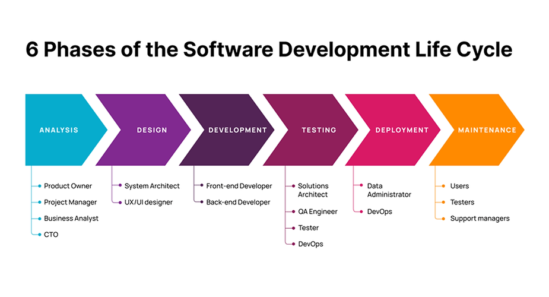
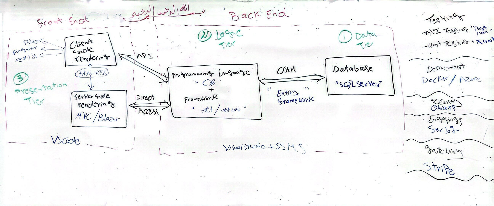
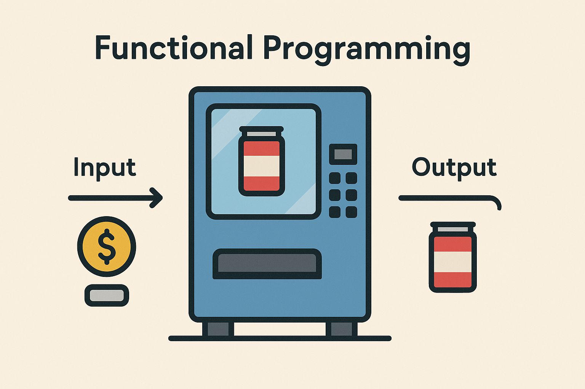
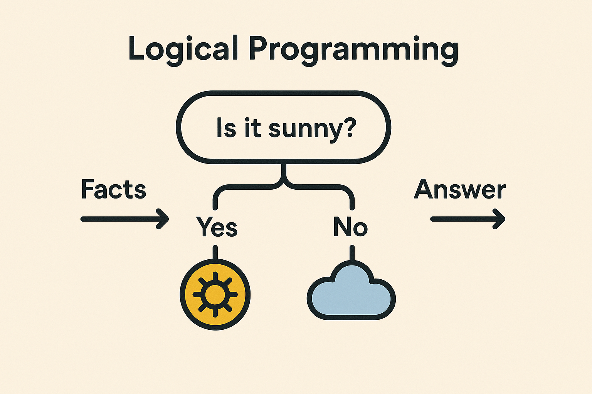
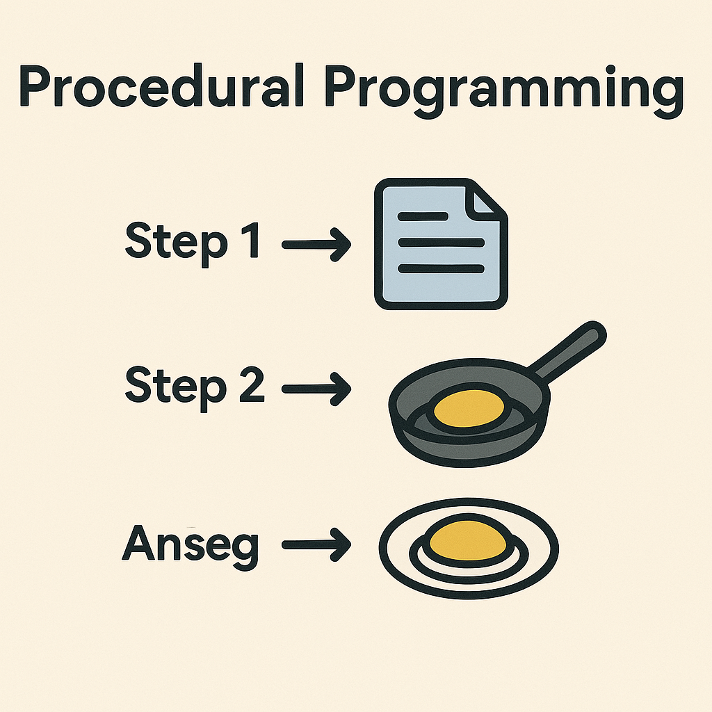
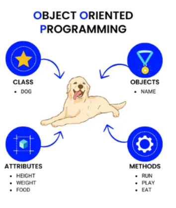
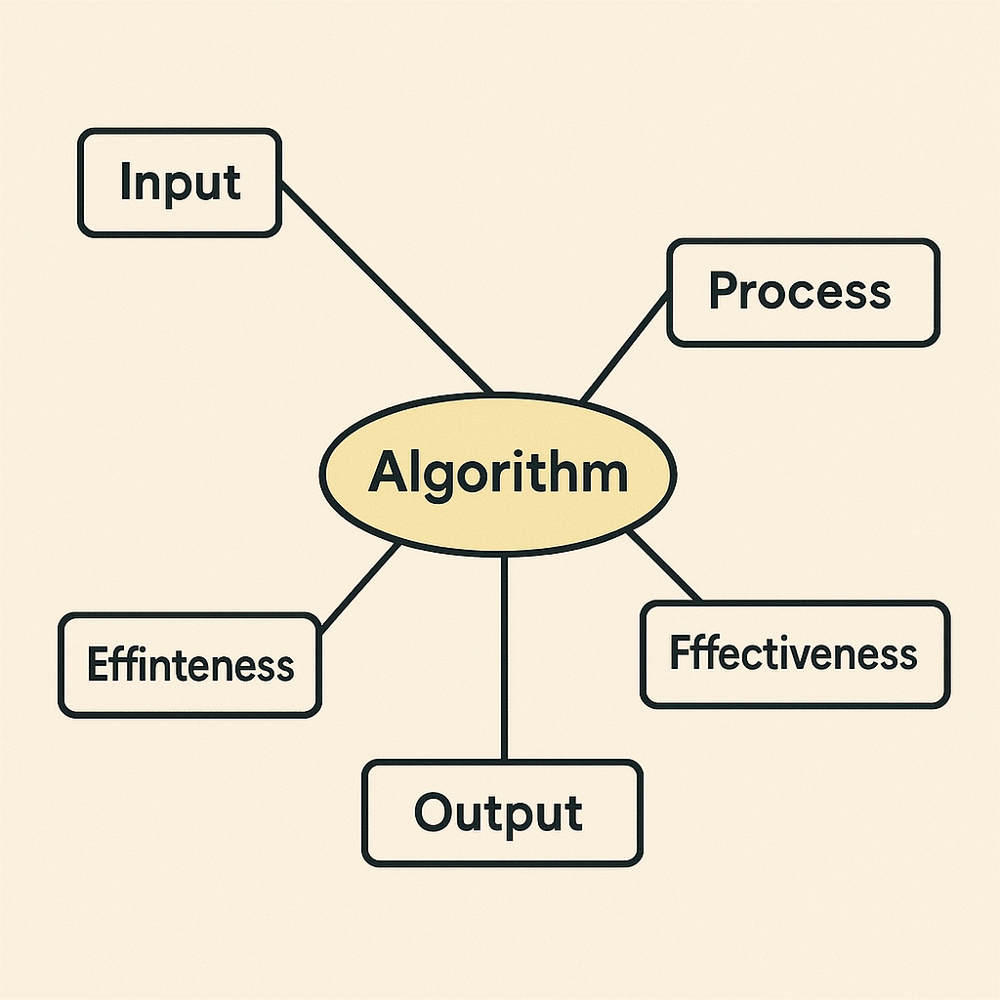
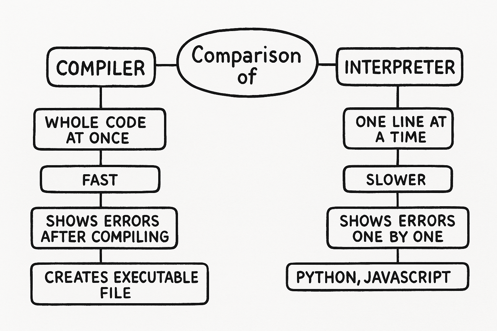
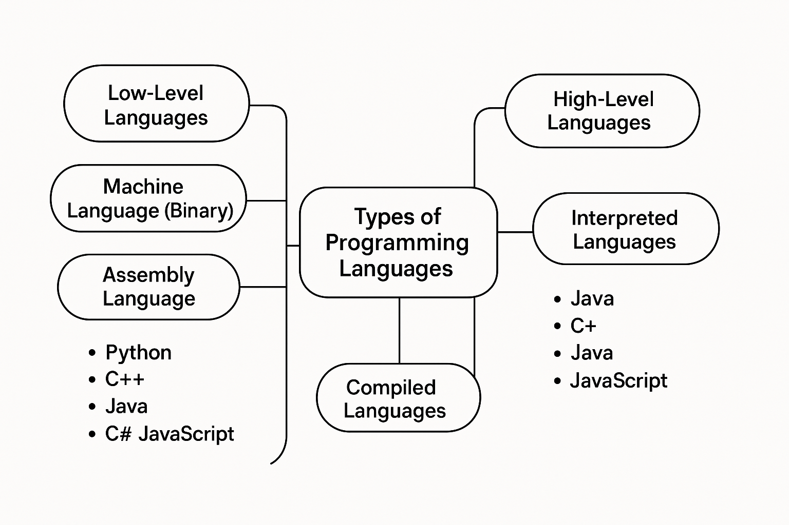

# SDLC, Agile, Git, and Web Development

##  Introduction
This repository contains essential information about the **Software Development Life Cycle (SDLC)**, **Agile & Scrum methodologies**, **Git version control**, and **Web Development Stacks**. It serves as a guide for understanding key concepts in software engineering and project management.

---

##  Software Development Life Cycle (SDLC)

### 🔹 Phases of SDLC
1. **Analysis** – Understanding client requirements.
2. **Design** – System architecture and UI/UX design.
3. **Development** – Coding the software (Front-end & Back-end).
4. **Testing** – Ensuring the software meets requirements.
5. **Deployment** – Making the software public.
6. **Maintenance** – Fixing bugs and updating features.

 **Reference Folder:** `Software Development Life Cycle/`

 **Diagram:**


---

##  Agile & Scrum Methodologies

### 🔹 Agile vs Waterfall
| Model     | Advantages | Disadvantages | When to Use |
|-----------|------------|---------------|--------------|
| **Agile** | Fast iterations, customer feedback, flexibility | Requires active involvement, can be hard to manage | When flexibility is needed |
| **Waterfall** | Clear structure, defined phases, easy tracking | Less flexibility, hard to adapt | When project requirements are stable |

 **Reference Folder:** `Agile and Scrum/`

 **Scrum Framework:**


---

##  Git Version Control

### 🔹 Why Use Git?
- Tracks code changes efficiently.
- Enables team collaboration.
- Allows rolling back to previous versions.

### 🔹 Common Git Commands
```bash
# Configure Git
$ git config --global user.name "Your Name"
$ git config --global user.email "your.email@example.com"

# Initialize a repository
$ git init

# Clone a repository
$ git clone <repo-url>

# Add and commit changes
$ git add .
$ git commit -m "Commit message"

# Push to remote
$ git branch -M main
$ git push -u origin main
```
 **Reference Folder:** `Git version control/`

**Git Workflow:**


---

##  Web Development Stacks

###  Web Application Architecture
1. **Data Tier** – Database (SQL, MongoDB, etc.)
2. **Logic Tier** – Backend (C#, Java, Python, etc.)
3. **Presentation Tier** – Frontend (React, Angular, Blazor, etc.)

###  Web Stacks Comparison
| Stack  | Language | Database | Framework |
|--------|----------|------------|------------|
| **.NET** | C# | SQL Server | .NET Core |
| **Java** | Java | Oracle SQL | Spring |
| **PHP** | PHP | MySQL | Laravel |
| **MERN** | JavaScript | MongoDB | Express.js |

 **Reference Folder:** `web development stacks/`

 **Full-Stack Development Diagram:**



updated_image_paths = {
    f"pp{i}": f"photos/pp{i}.png" for i in range(1, 8)
}

final_readme_content = f"""
# Programming in General

## Programming Paradigms

**Programming Paradigms** are different ways of thinking and writing a computer program. The most common ones are:

### 1. Procedural Programming
A basic style where the program is listed step by step.  
Example: Making a cheese sandwich.



### 2. Object-Oriented Programming (OOP)
You create objects like a cat. Each object has data (color, type, eye color) and actions (jump, run, speak).  
Helps in reusing code and organizing large systems.



### 3. Functional Programming
Like a vending machine. You give input → get output. No memory, no change in internal state.



### 4. Logic Programming
You give facts and rules. The computer uses logic to answer questions.



## Comparison Table

| Method                     | Pros                                          |
|----------------------------|-----------------------------------------------|
| Procedural Programming     | Step by step, easy to understand              |
| Object-Oriented Programming| Good for big systems, helps reuse code        |
| Functional Programming     | Clean and safe, good for math and data        |
| Logic Programming          | No steps, only logic. Good for smart systems  |

---

## Algorithm Programming Components

An **Algorithm** is a set of steps to solve a problem.

**Main Parts:**
1. **Input** – the data
2. **Process** – the steps
3. **Output** – the result

**Other Concepts:**
- **Definiteness**: Steps must be clear
- **Finiteness**: Must end
- **Effectiveness**: Easy to do by a person or computer



---

## Types of Programming Languages

### 1. Low-Level Languages
- **Machine Language** – 0s and 1s
- **Assembly Language** – short commands like MOV, ADD

### 2. High-Level Languages
- Easy for humans (e.g., Python, C++, Java)

### Based on Execution

#### A. Compiled Languages
- Translates all code at once
- Examples: C, C++

#### B. Interpreted Languages
- Runs line by line
- Examples: Python, JavaScript

#### C. Hybrid Languages
- Mix of both
- Examples: Java, C#



---

## Compiler vs Interpreter

| Feature         | Compiler                           | Interpreter                        |
|-----------------|-------------------------------------|-------------------------------------|
| Execution       | Whole code at once                 | One line at a time                 |
| Speed           | Fast after compiling               | Slower                             |
| Errors          | Shows all after compiling          | One by one                         |
| Output          | Creates .exe file                  | No file created                    |
| Languages       | C, C++, Java (partly)              | Python, JS                         |

**Example:**  
- **Compiler**: Print full essay at once  
- **Interpreter**: Read it out loud line by line


"""
