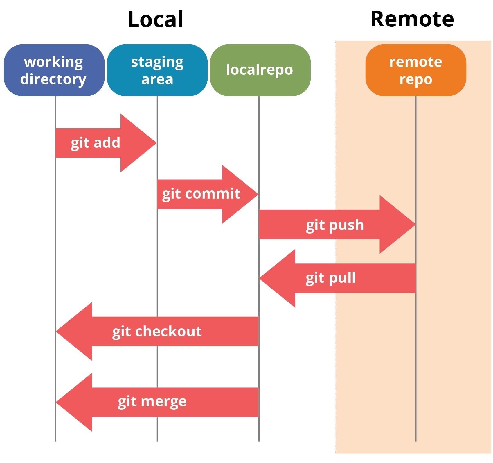

# SDLC, Agile, Git, and Web Development

##  Introduction
This repository contains essential information about the **Software Development Life Cycle (SDLC)**, **Agile & Scrum methodologies**, **Git version control**, and **Web Development Stacks**. It serves as a guide for understanding key concepts in software engineering and project management.

---

##  Software Development Life Cycle (SDLC)

### 🔹 Phases of SDLC
1. **Analysis** – Understanding client requirements.
2. **Design** – System architecture and UI/UX design.
3. **Development** – Coding the software (Front-end & Back-end).
4. **Testing** – Ensuring the software meets requirements.
5. **Deployment** – Making the software public.
6. **Maintenance** – Fixing bugs and updating features.

 **Reference Folder:** `Software Development Life Cycle/`

 **Diagram:**


---

##  Agile & Scrum Methodologies

### 🔹 Agile vs Waterfall
| Model     | Advantages | Disadvantages | When to Use |
|-----------|------------|---------------|--------------|
| **Agile** | Fast iterations, customer feedback, flexibility | Requires active involvement, can be hard to manage | When flexibility is needed |
| **Waterfall** | Clear structure, defined phases, easy tracking | Less flexibility, hard to adapt | When project requirements are stable |

 **Reference Folder:** `Agile and Scrum/`

 **Scrum Framework:**


---

##  Git Version Control

### 🔹 Why Use Git?
- Tracks code changes efficiently.
- Enables team collaboration.
- Allows rolling back to previous versions.

### 🔹 Common Git Commands
```bash
# Configure Git
$ git config --global user.name "Your Name"
$ git config --global user.email "your.email@example.com"

# Initialize a repository
$ git init

# Clone a repository
$ git clone <repo-url>

# Add and commit changes
$ git add .
$ git commit -m "Commit message"

# Push to remote
$ git branch -M main
$ git push -u origin main
```
 **Reference Folder:** `Git version control/`

**Git Workflow:**


---

##  Web Development Stacks

###  Web Application Architecture
1. **Data Tier** – Database (SQL, MongoDB, etc.)
2. **Logic Tier** – Backend (C#, Java, Python, etc.)
3. **Presentation Tier** – Frontend (React, Angular, Blazor, etc.)

###  Web Stacks Comparison
| Stack  | Language | Database | Framework |
|--------|----------|------------|------------|
| **.NET** | C# | SQL Server | .NET Core |
| **Java** | Java | Oracle SQL | Spring |
| **PHP** | PHP | MySQL | Laravel |
| **MERN** | JavaScript | MongoDB | Express.js |

 **Reference Folder:** `web development stacks/`

 **Full-Stack Development Diagram:**


---

##  How to Use This Repository
- Browse through the **folders** for detailed explanations.
- Check the **photos** folder for diagrams and visuals.
- Clone this repo and explore the Git version control system.

```bash
# Clone the repo
$ git clone https://github.com/yourusername/SDLC-Agile-Git-Web.git

# Navigate into the folder
$ cd SDLC-Agile-Git-Web

# Open in VS Code
$ code .
```
---
